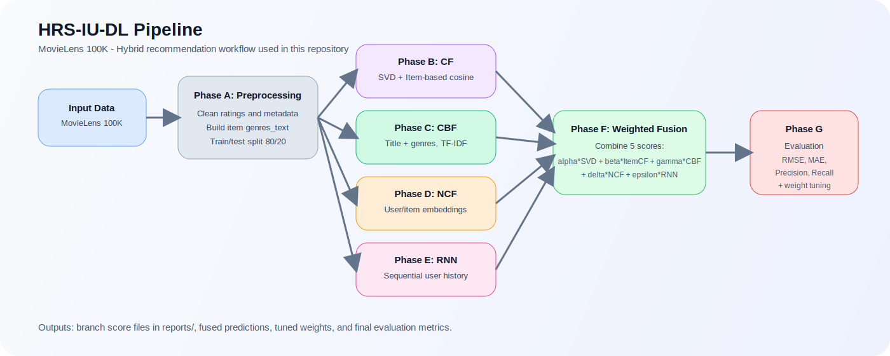

## 1. Mục tiêu dự án

- Xây dựng pipeline hybrid recommendation gồm `CF + CBF + NCF + RNN`.
- Đánh giá theo đúng nhóm metric: `RMSE`, `MAE`, `Precision`, `Recall`.
- Đối chiếu kết quả reproduction với:
  - kết quả mục tiêu mà paper công bố
  - các phương pháp cũ hơn được paper dùng làm baseline so sánh

## 2. Pipeline phương pháp



Xem bản interactive tại [flow_chard.html](./flow_chard.html).


## 3. Cấu trúc repo

- `src/data_code/phase_a_data_pipeline.py`: tải dữ liệu, làm sạch, split, QA report.
- `src/models/cf_branch.py`: CF gồm `SVD` và `item-based cosine`.
- `src/models/cbf_branch.py`: content-based filtering bằng `TF-IDF`.
- `src/models/ncf_branch.py`: neural collaborative filtering.
- `src/models/rnn_branch.py`: mô hình chuỗi theo lịch sử tương tác.
- `src/models/phase_f_fusion_run.py`: weighted-sum fusion.
- `src/models/phase_g_eval_and_tuning.py`: tuning trọng số và đánh giá cold-start.
- `tests/`: unit tests cho từng phase chính.
- `reports/`: artifact kết quả thực nghiệm hiện tại.

## 4. Thành phần mô hình hiện tại

Phương pháp đang thực hiện trong repo là:

- `CF branch`
  - `SVD` tái tạo ma trận user-item
  - `Item-based cosine similarity`
- `CBF branch`
  - tạo biểu diễn item từ `title + genres_text`
  - vector hóa bằng `TF-IDF`
- `NCF branch`
  - user embedding + item embedding
  - dự đoán rating qua `dot product`
- `RNN branch`
  - mã hóa chuỗi lịch sử tương tác theo `timestamp`
  - dùng `SimpleRNN` để lấy trạng thái người dùng
- `Fusion`
  - cộng có trọng số 5 score thành phần:
  - `r_hat = alpha*SVD + beta*ItemBased + gamma*CBF + delta*NCF + epsilon*RNN`

## 5. Kết quả hiện tại

Kết quả lấy từ:
- [reports/phase_f_fusion_summary.json](/C:/Users/Asus/Desktop/rs/reports/phase_f_fusion_summary.json)
- [reports/phase_g_eval_and_tuning.json](/C:/Users/Asus/Desktop/rs/reports/phase_g_eval_and_tuning.json)

### 5.1 So với mục tiêu paper

| Thiết lập | RMSE | MAE | Precision | Recall |
| --- | ---: | ---: | ---: | ---: |
|  trước tuning | 0.9589 | 0.7709 | 0.7262 | 0.7283 |
|  sau tuning | 0.9558 | 0.7680 | 0.7316 | 0.7177 |


### 5.2 Trọng số fusion tốt nhất hiện tại

Theo [reports/phase_g_eval_and_tuning.json](/C:/Users/Asus/Desktop/rs/reports/phase_g_eval_and_tuning.json), bộ trọng số tốt nhất đang là:

- `alpha = 0.4` cho `SVD`
- `beta = 0.0` cho `Item-based`
- `gamma = 0.1` cho `CBF`
- `delta = 0.2` cho `NCF`
- `epsilon = 0.3` cho `RNN`

## 6. So sánh với các phương pháp cũ hơn o


### 6.1 So sánh theo kết quả phương pháp hiện tại

| Phương pháp | Năm | RMSE | MAE | Ghi chú so với phương pháp hiện tại |
| --- | ---: | ---: | ---: | --- |
| CF for RS | 2020 | 0.9170 | - | Tốt hơn phương pháp hiện tại về RMSE |
| CF-based SVD and RBM | 2021 | 0.9557 | 0.6699 | Gần ngang RMSE, tốt hơn phương pháp hiện tại về MAE |
| SVD | 2022 | 0.9071 | 0.7159 | Tốt hơn phương pháp hiện tại |
| Matrix Factorization | 2023 | 0.9392 | - | Tốt hơn phương pháp hiện tại về RMSE |
| CF, SVD, DL | 2023 | 0.9908 | - | Kém hơn phương pháp hiện tại |
| CF | 2023 | 0.9119 | 0.7084 | Tốt hơn phương pháp hiện tại |
| Hybrid CNN | 2024 | 0.8890 | 0.6770 | Tốt hơn phương pháp hiện tại |
|`HRS-DL` phương pháp hiện tại | 2026 local run | 0.9558 | 0.7680 | Kết quả thực tế |

Kết luận ngắn:

- Ở trạng thái phương pháp hiện tại, mô hình hybrid trong repo mới chỉ vượt rõ một baseline yếu hơn là `CF, SVD, DL (2023)`.


### 6.2 So sánh theo kết quả mà paper công bố

| Phương pháp | Năm | RMSE | MAE |
| --- | ---: | ---: | ---: |
| CF for RS | 2020 | 0.9170 | - |
| CF-based SVD and RBM | 2021 | 0.9557 | 0.6699 |
| SVD | 2022 | 0.9071 | 0.7159 |
| Matrix Factorization | 2023 | 0.9392 | - |
| CF, SVD, DL | 2023 | 0.9908 | - |
| CF | 2023 | 0.9119 | 0.7084 |
| Hybrid CNN | 2024 | 0.8890 | 0.6770 |
| HRS-DL theo paper | 2024 | 0.7723 | 0.6018 |

 `HRS-DL` vượt toàn bộ baseline cũ hơn về cả `RMSE` lẫn `MAE`, và cũng là mô hình duy nhất trong bảng có báo cáo đồng thời `Precision = 0.8127` và `Recall = 0.7312`.

## 7. Cold-start

Kết quả cold-start hiện tại:

| Kịch bản | RMSE | MAE | Precision | Recall |
| --- | ---: | ---: | ---: | ---: |
| New Users | 1.0278 | 0.8584 | 0.7734 | 0.5023 |
| New Items | 1.5669 | 1.3466 | 0.4545 | 1.0000 |

Đối chiếu với paper:

- `New Users`: paper báo `Precision 0.762`, `Recall 0.685`
- `New Items`: paper báo `MAE 0.612`, `Precision 0.788`, `Recall 0.702`

Điểm cần lưu ý:

- `New Users` trong repo hiện đang dùng một cách xấp xỉ cold-start khi không có true new users rõ ràng trong split ngẫu nhiên.
- `New Items` có số mẫu rất ít, nên metric dao động mạnh và chưa phản ánh tốt năng lực tổng quát hóa.

## 8. Cách chạy nhanh

### Cài môi trường

```powershell
.\.venv\Scripts\Activate.ps1
python -m pip install -r requirements.txt
```

### Chạy toàn bộ pipeline

```powershell
.\run_all_pipeline.ps1
```

### Hoặc chạy theo phase

```powershell
python src/data_code/phase_a_data_pipeline.py
python src/models/phase_b_cf_run.py
python src/models/phase_c_cbf_run.py
python src/models/phase_d_ncf_run.py
python src/models/phase_e_rnn_run.py --batch-size 128
python src/models/phase_f_fusion_run.py
python src/models/phase_g_eval_and_tuning.py
```

### Chạy test

```powershell
python -m unittest discover -s tests -p "test_*.py"
```


## 10. Tài liệu tham chiếu
